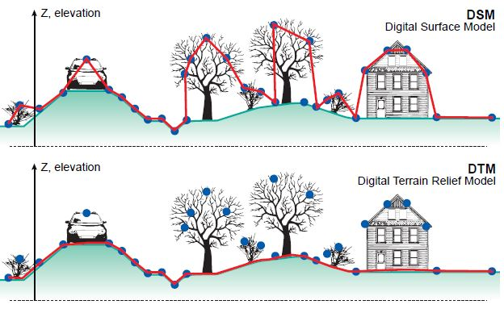
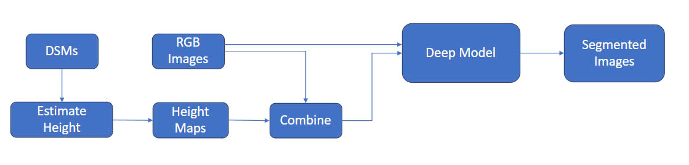
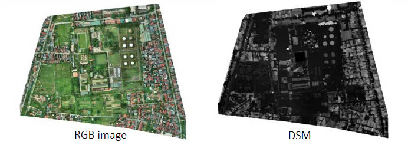
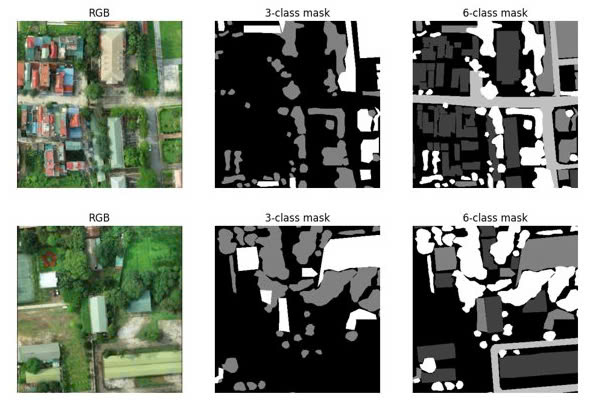
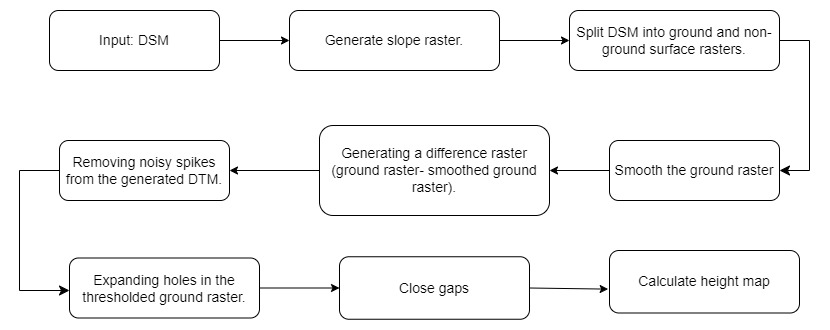
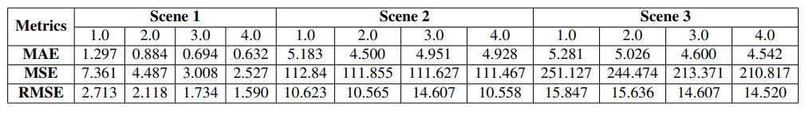
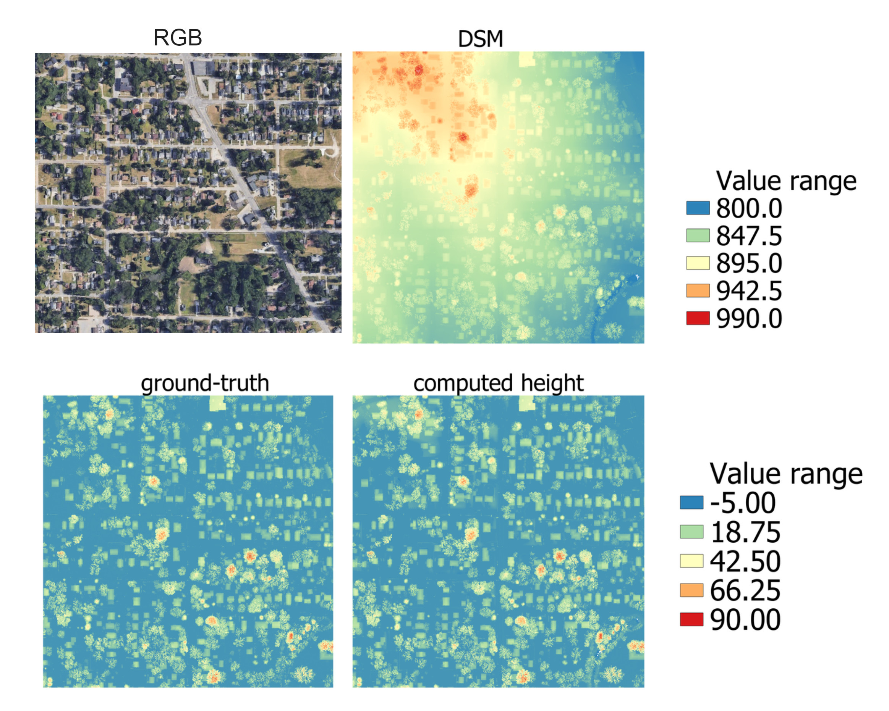

# Estimate The Height Maps From The Drone-Based Elevation Maps and Applications
This project focuses on developing an efficient algorithm to generate accurate height maps from drone-based elevation data by processing Digital Surface Models (DSMs) to produce Digital Terrain Models (DTMs). The algorithm will address challenges such as irregular terrain and image distortions while ensuring scalability and adaptability across different drones and sensors. A key objective is to enhance computational efficiency and reduce resource consumption, making the algorithm suitable for large datasets and real-world applications.

In practice, distinguishing between objects like grass and trees, which share similar colors, poses a significant challenge. To address this, the project also aims to demonstrate the algorithm’s ability to improve object segmentation by integrating height data with RGB indices. This integration will be tested on two object segmentation tasks: segmenting tree and grass objects, and segmenting tree, grass, building, water, and road classes. The use of height data is expected to improve accuracy, especially in cases where objects have similar colors.
### Digital Terrain Model (DTM) and Digial Surface Model(DSM)
The Digital Terrain Model (DTM) product represents the elevation of the ground, while the Digital Surface Model (DSM) product represents the elevation of the tallest surfaces at that point.

From above image, we can see that the difference between the DSM and DTM represents the height of an object. To compute the height map, we first calculate the DTM from the DSM, then subtract the DTM from the DSM to obtain the height map.

# Project Workflow
Project Workflow

In this project, I first used the DSMs from the dataset to estimate height maps for each RGB image. These computed height maps were then combined with the RGB images to create an enhanced dataset. I utilized the ResNet34 and UNet models to train on both the RGB dataset and the RGB+height dataset for two tasks: segmenting tree and grass objects, as well as segmenting tree, grass, building, road, and water objects. The performance of each model was then evaluated to compare the impact of using height data versus RGB data alone in the segmentation tasks.

# Methodology
## Dataset
The dataset for this project was provided by the Naver team and includes both RGB images and Digital Surface Models (DSMs). Using the DSMs, I applied a height estimation algorithm developed in this project to compute height maps, which were then combined with the RGB images to create an enhanced dataset.



I manually labeled six classes—tree, grass, water, building, road, and background—on the RGB images using the AnyLabeling tool, and created a corresponding mask image for each RGB image. The images were then cropped into smaller patches of 400x400 pixels and split into training and testing sets. The training set consists of 1,787 patches, while the testing set includes 63 patches (cropped from a larger image for testing and inference).

RGB and labeled mask patches


## Height Map Estimation
##### Step-by-Step process for the Height Map Estimation Algorithm:


## Segmentation Utilizing The Height Map
The baseline models used for image segmentation in this section are UNet and a modified ResNet34, which has been adapted to an encoder-decoder architecture similar to UNet. The objective is to train these models on a dataset of drone images and assess the benefits of incorporating height data to improve segmentation accuracy.

These models were trained using two datasets: RGB images and RGB+height images, with each model trained for 300 epochs.

# Result

## Height Map Estimation Results

The table above displays the Mean Absolute Error (MAE), Mean Square Error (MSE), and Root Mean Square Error (RMSE) of the testing algorithm across three scenes, with varying parameter ```threshold``` values.

##### Comparison of computed height maps with ground-truth example:


## Training Loss Graph:


## Performance Comparison
##### Perfomance comparison of UNet model for segmentation problems with and without height data


##### Perfomance comparison of ResNet34 model for segmentation problems with and without height data


## Qualitative Analysis
##### U-Net prediction results for 3-classes segmentation:


##### U-Net prediction results for 6-classes segmentation:


##### U-Net prediction results for 3-classes segmentation:


##### U-Net prediction results for 3-classes segmentation:


